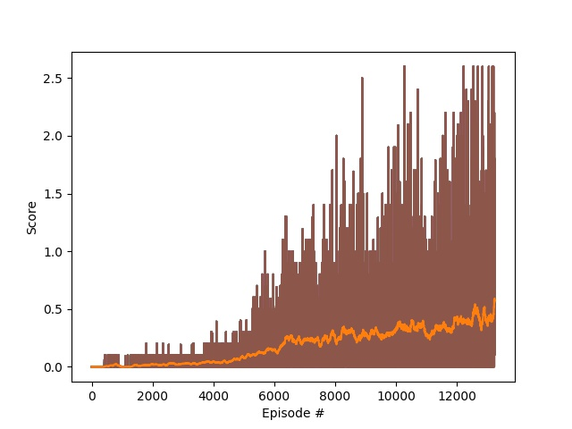
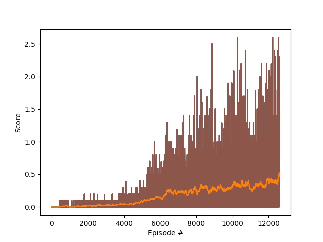

# Learning algorithm
## Problem statement:
Unlike single agent environments, this environment contains 2 agents which shall cooperate towards a
common goal. The incentive is to play tennis and keep the ball up in the air as long as possible.
Since there are multiple agents in the same environment, the environment is more stochastic w.r.t. one
agent because it observes the other agent as well. And the other agent changes behavior over time, thus
the estimation of the next state is very noisy. Learning to deal with this noise is very important for
a stable learning.
This partucular environment contains 2 agents in the left and right half of a 2D tennis cord. A ball
is dropped in one of the fields. Each agent controls a tennis racket to hit the ball of. The task of
the agents is to play the ball back and forth between them and not letting it fall down to the floor.
If an agent hits the ball over the net, it receives a reward of +0.1. If an agent lets a ball hit the
 ground or hits the ball out of bounds, it receives a reward of -0.01. Thus, the goal of each agent is
 to keep the ball in play.

The observation space consists of 8 variables corresponding to the position and velocity of the ball and
racket. Each agent receives its own, local observation. Two continuous actions are available,
corresponding to movement toward (or away from) the net, and jumping.

The task is episodic, and in order to solve the environment, your agents must get an average score of
+0.5 (over 100 consecutive episodes, after taking the maximum over both agents). Specifically,
- After each episode, we add up the rewards that each agent received (without discounting), to get a
score for each agent. This yields 2 (potentially different) scores. We then take the maximum of these 2
scores.
- This yields a single score for each episode.

The environment is considered solved, when the average (over 100 episodes) of those scores is at least +0.5.

## 2 DDPG agents
Similar to DDPG in the [reacher environment](https://github.com/sk-stm/RL_robot_arm_control) the agents are
trained using the DDPG (deep deterministic policy gradient) algorithm. The agent acts in the environment to create
an understanding of what actions create the most rewards in what states. The agent perceives the state of the
environment and acts according to a policy. For each action it takes, it receives an reward and observes the next
states it transitions to. Also it observes if the episode ended or not.
Each observation (state, action, reward, next state, done) is stored in a list, the replay memory for each agent
separately.

The full explanation of the DDPG algorithm can be seen in my
[reacher environment repository](https://github.com/sk-stm/RL_robot_arm_control/blob/main/Report.md). I will
focus here only on the differences to the cooperating agents case.

First I changed the network size to be bigger. So the actor network looks like:
```
self.actor_fc1 = nn.Linear(state_size*2, 512)
self.actor_fc2 = nn.Linear(512, 256)
self.actor_fc3 = nn.Linear(256, action_size)
```

and the critic network looks like:
```
self.critic_fc1 = nn.Linear(state_size*num_agents, 512)
self.critic_fc2 = nn.Linear(512 + action_size, 256)
self.critic_fc3 = nn.Linear(256, 1)
```

The difference to the multi agent case is that the environment becomes much more unstable because each agent
perceives the other agent as part of the environment that is more or less unpredictable. The other agent
changes it's behavior due to a change in its policy over time. Therefore the state to next-state relation
changes over time. This makes the learning much mor unstable. In my solution I tackled this problem with
careful parameter tuning and slow training and update rates. Since the environment is simple enough this
approach works. I'm sure with more tuning even a faster convergence can be achieved. However I found that
with this settings the training is much more likely to converge and produce a result at all.

There are several other ways to engage the unsteady environment: In [this](https://arxiv.org/pdf/1908.03963.pdf)
paper they list several approaches:

1. IQL - each agent accesses it's local observation and the overall agents try to maximize a joint reward
Each agent runs a separate Q-learning algirthm.
2. Disabling the replay memory - disabling the replay memory reduces the problem that a sample might be drawn
from that doesn't reflect the current behavior of the other agent and therefore leading to a different next state.
This introduces another problem that the states that are learned on have temporal correlation. So this problem
has to be taken into account differently
3. reducing the replay memory size - same as above but with a small replay memory. The idea is that the replay memory
can be used if the state to next-state correlation is not broken much if the history that is stored in the replay memory
is short enough and the agents don't change behavior too quickly. Here a balance have to be found between a large
enough replay memory to ensure temporal independence of drawn samples and the change of actor behavior
4. other algorithms like HDRQN, CERTs, MADDPG that are out of scope of this report.

# Improvements
Network size:
- The assumption is that the perceived state is bigger so a larger network would work better. But I have never
tried different sizes because it worked well. A smaller network might suffice and even train faster.

Different algorithms:
- one could use one of the more sophisticated algorithms described above to solve the environment faster

Hyper parameter optimization:
- With more time and effort put into hyper parameter optimization I'm sure the environment can be solved quicker.
- Specifically what one could try is:
    - larger learning rate for actor and critic
    - bigger update rate from local to target network (TAU)
    - smaller replay memory to reduce wrong assumptions of the action of the other agent

## MADDPG
As time went by is also implemented the MADDGP (multi agent deep deterministic policy gradient) that extends
single agent DDPG for the multi agent purpose. It works as follows:
Each agent has it's own actor and critic and acts according to the action that the actor creates. The
agents actor only perceives it's own local state of the environment and acts accordingly. On the contrary
 each critic perceives all states and all the actions of each agent. It uses this information to evaluate
 the state of each agent with respect to all other agents. The experience that all agents create is stored
 in a shared experience buffer during training. That way each drawn sample from the replay buffer will
 contain a full example of the actions and local states of each agent. Each critic will use this
 information to optimize the value function for it's own agent.
Besides this the algorithm works just like single agent DDPG which is described in
[my other repository](https://github.com/sk-stm/RL_robot_arm_control/blob/main/Report.md).

Unfortunately the implementation and training is not complete yet. I didn't have time to tune the parameters
of my MADDPG to solve the environment yet. However, I intend to do that in the future since this is a very natural
 extension of the DDPG algorithm in project 2. Therefore this repository contains the code of MADDPG but not a solution
 based on that algirthm.

# Results
The rewards received by my best agent of this type can be shown in this figure:


This agent was trained for 13242 episodes and reached an average reward of 0.57 including noise addition to the action.

The reward > 0.5 was achieved after 12596 episodes. The next figure shows the learning process of that agent.


The agents act stable in the environment for a long period of time and therefore learned to cooperate.

# Parameters for DDPG:
### LEARNING PARAMETERS
- GAMMA = 0.99
- BATCH_SIZE = 128
- BUFFER_SIZE = int(1e6)
- TAU = 1e-3
- LR_ACTOR = 1e-4
- LR_CRITIC = 1e-4
- WEIGHT_DECAY = 0.
- UPDATE_EVERY = 1
- NUM_EPISODES = 100000

### NOISE PARAMETERS
- INITIAL_NOISE_WEIGHT = 1
- NOISE_REDUCTION_FACTOR = 1
- THETA = 0.15
- MU = 0
- SIGMA = 0.2

SAVE_DISTANCE = 0.01
